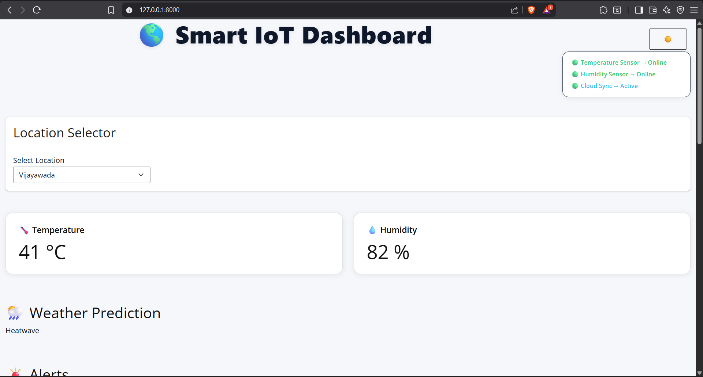
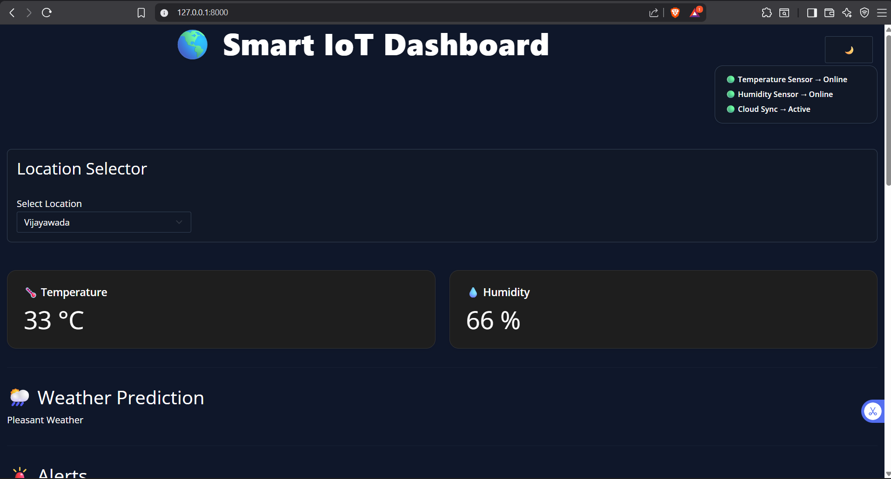
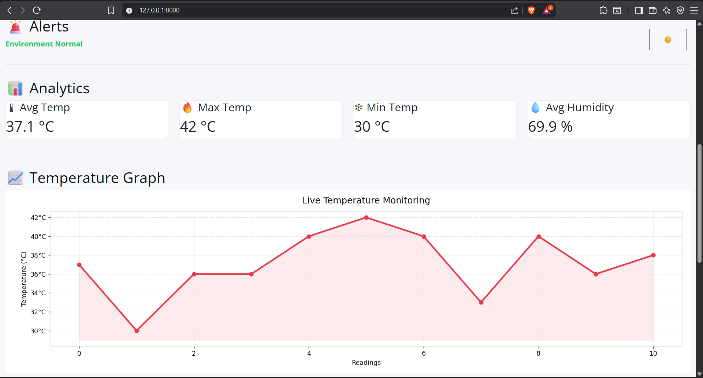
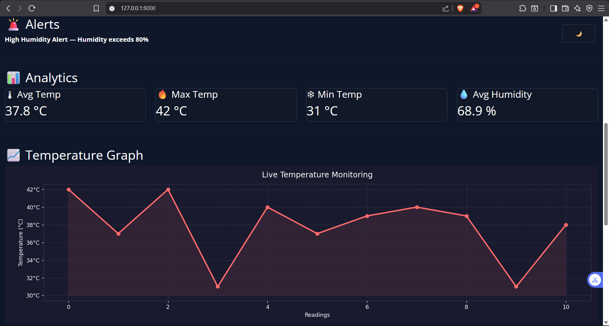
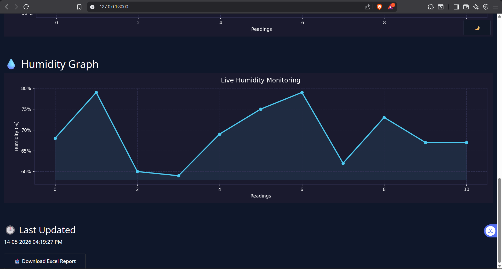

# 🌎 Smart IoT Dashboard

A real-time environmental monitoring dashboard built with **Python Shiny**, simulating IoT sensor data across multiple cities. Designed as a full-featured prototype demonstrating live data visualization, alerting, analytics, and report generation — the kind of system used in smart buildings, agriculture, and industrial monitoring.

> **Note:** This version uses simulated sensor data with realistic city-specific ranges. It is structured to be easily extended to real hardware (MQTT / serial / REST) with minimal changes to `data/sensor_data.py`.

---

## 📸 Screenshots

| Light Mode | Dark Mode |
|---|---|
|  |  |
|  |  |
|  |  |

---

## 📊 Excel Report Export


---

## ✨ Features

- **Live sensor simulation** — Temperature & humidity data updates every 30 seconds with city-realistic ranges
- **Multi-location support** — Switch between Vijayawada, Hyderabad, Chennai, and Bangalore
- **Real-time alert system** — Automatic alerts for out-of-range temperature (< 20°C or > 38°C) and humidity (< 30% or > 80%)
- **Weather condition estimation** — Classifies environment as Heatwave / Rain Possible / Cold / Pleasant based on live readings
- **Analytics panel** — Live min, max, and average stats computed over a rolling 15-reading window
- **Interactive charts** — Live temperature and humidity trend graphs with light/dark theming (Matplotlib)
- **Light / Dark mode** — Full UI theme toggle with smooth transitions
- **Excel report export** — One-click download of styled `.xlsx` report with auto-fitted columns and bold headers

---

## 🛠 Tech Stack

| Layer | Technology |
|---|---|
| Framework | Python Shiny (`shiny`) |
| Data Visualization | Matplotlib |
| Data Handling | Pandas |
| Report Export | OpenPyXL |
| Styling | Custom CSS (light + dark) |
| Language | Python 3.12 |

---

## 📁 Project Structure

```bash
Smart-IoT-Dashboard/
│
├── app.py
├── requirements.txt
├── assets/
│   └── style.css
│
├── data/
│   └── sensor_data.py
│
├── dashboard/
│   ├── cards.py
│   └── graphs.py
│
├── alerts/
│   └── alert_system.py
│
├── analytics/
│   └── stats.py
│
├── weather/
│   └── weather_prediction.py
│
├── location/
│   └── location_selector.py
│
├── theme/
│   └── theme_config.py
│
└── screenshots/
```

---

## 🚀 Getting Started

### Prerequisites

- Python 3.10 or higher
- pip

---

## ⚙️ Installation

```bash
# Clone the repository
git clone https://github.com/Satya23BDS0326/Smart-IoT-Dashboard.git

# Open project folder
cd Smart-IoT-Dashboard

# Create virtual environment
python -m venv venv

# Activate virtual environment (Windows)
venv\Scripts\activate

# Install dependencies
pip install -r requirements.txt

# Run the app
shiny run app.py
```

---

## 🌐 Open in Browser

After running the project, open:

```bash
http://127.0.0.1:8000
```

---

## 🔌 Extending to Real Hardware

The project is designed so that plugging in real sensors requires changes only to `data/sensor_data.py`.

Example for ESP32 / Arduino serial integration:

```python
import serial

def generate_sensor_data(location):
    ser = serial.Serial('/dev/ttyUSB0', 9600)
    line = ser.readline().decode().strip()

    temp, humidity = line.split(',')

    return {
        "temp": float(temp),
        "humidity": float(humidity)
    }
```

You can also replace the simulated generator with:
- MQTT subscriptions
- REST APIs
- Firebase
- Cloud IoT platforms

without changing the dashboard UI.

---

## 📊 Sample Alert Thresholds

| Condition | Threshold |
|---|---|
| High Temperature | > 38 °C |
| Low Temperature | < 20 °C |
| High Humidity | > 80 % |
| Low Humidity | < 30 % |

---

## 📥 Excel Report Fields

Each downloaded report includes:

- Location
- Timestamp
- Current Temperature
- Current Humidity
- Weather Condition
- Active Alerts
- Average Temperature
- Average Humidity

---

## 🗺️ Future Improvements

- [ ] Real sensor integration using MQTT / Serial
- [ ] Historical database logging
- [ ] User authentication
- [ ] Email / SMS alerts
- [ ] Cloud deployment
- [ ] Additional sensors (CO₂, Air Quality, Noise)

---

## 👨‍💻 Author

**Satya**

GitHub:  
[Satya23BDS0326 GitHub Profile](https://github.com/Satya23BDS0326?utm_source=chatgpt.com)

---

## 📄 License

This project is open source and available under the MIT License.
